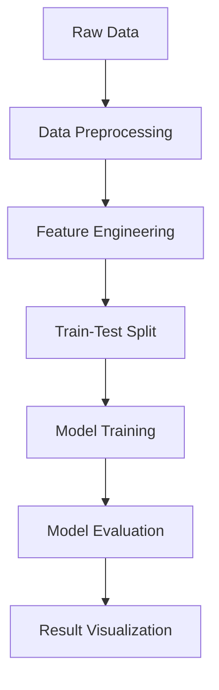

# Capstone Project – IIT Guwahati

## 🔍 Project Overview

This repository contains the code and documentation for the **Capstone Project** undertaken at **Indian Institute of Technology, Guwahati**. The project revolves around [brief 1-2 line summary here – please update this section with your exact project goal. For example: developing a machine learning model for crop yield prediction, or building an AI agent for document summarization].

This end-to-end project involved data preprocessing, modeling, evaluation, and visualization. The goal was to apply theoretical knowledge to a real-world problem and showcase practical machine learning skills.

---

## 🛠️ Tech Stack Used

- **Programming Language:** Python
- **Data Handling:** Pandas, NumPy
- **Data Visualization:** Matplotlib, Seaborn
- **Machine Learning/AI:** Scikit-learn
- **Notebooks:** Jupyter
- **Version Control:** Git, GitHub

---

## 🏗️ Architecture Diagram

##📁 Repository Structure
css
Copy
Edit
capstone_project_iitg/
├── data/
│   ├── raw/
│   └── processed/
├── notebooks/
│   └── EDA_and_Modeling.ipynb
├── src/
│   └── main.py
├── README.md
└── requirements.txt
